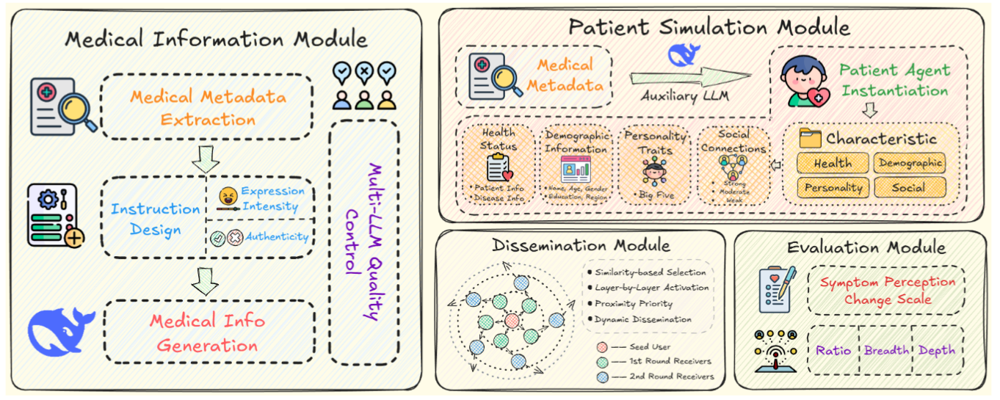
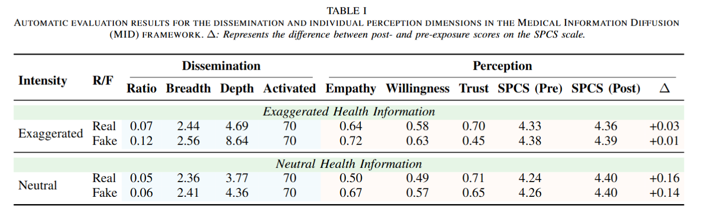
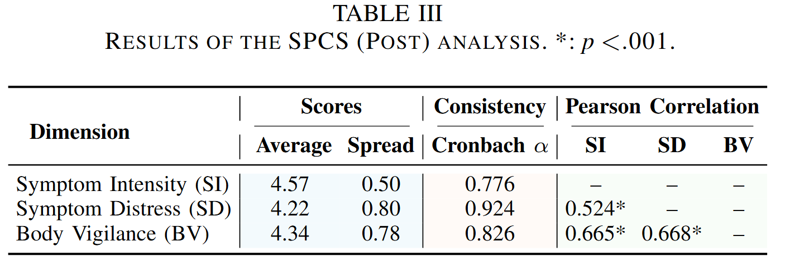

<h2 align="center">Uncovering Risks of Neutral Medical Information Dissemination: Modeling Anxiety Amplification via Multi-Agent Simulation</h2>

:fire:This work proposes **MID**, an LLM-driven **M**edical **I**nformation **D**iffusion framework that reveals a counterintuitive risk: *seemingly neutral medical information can amplify users’ symptom perception and anxiety more strongly than exaggerated content*. 

### Brief Introduction

The rapid growth of online medical information has profoundly reshaped how people perceive their symptoms and health conditions. On social media, users face streams of algorithmically curated health content that reinforces their pre-existing concerns—creating a subtle *information echo chamber* that often elevates health anxiety. While previous studies predominantly focus on malicious misinformation or fake medical content, an overlooked but critical question remains:

>**Can *neutral*, factually correct medical information also cause psychological amplification effects?**

To address this, we introduce **MID (Medical Information Diffusion)**—a large-scale, LLM-based multi-agent simulation framework designed to model how medical information with different **expression intensities** (neutral vs. exaggerated) and **authenticity** (real vs. fake) spreads across social networks and influences users’ symptom perception. MID integrates four key modules:

- **Medical Information Module**: Generates diverse medical content (neutral/exaggerated, real/fake) from authoritative metadata.

- **Patient Simulation Module**: Constructs realistic patient agents with medical states, demographics, personality, and social ties.

- **Dissemination Module**: Models social propagation via an Independent Cascade–inspired process.

- **Evaluation Module**: Measures group-level diffusion and individual-level psychological changes using our proposed **SPCS (Symptom Perception Change Scale)**. 

Through extensive simulations across 70 diseases, we uncover a counterintuitive but important finding:

  > **Neutral medical information, which appears objective and credible, induces greater symptom amplification, emotional distress, and bodily vigilance than exaggerated content,** even though exaggerated content spreads further and faster.

Our work highlights the underestimated psychological risks of neutral medical communication and provides a computational foundation for understanding how health information shapes public emotion and behavior in social media environments.

### Framework
<div align="center">
    
    <p class="image-caption">Figure 1: Overview of the MID framework. The framework generates medical information with varying authenticity and expressive intensity, dynamically activates simulated patient agents during dissemination, and evaluates both group-level and individual-level metrics.</p>
</div>


## Run

**Preparation**

  ```shell
  pip3 install -r requirements.txt
  ```
* Set your LLM API_KEY in `config.json`

**Run **

```shell
python propagation_engine.py 
```


## Main Results


<div align="center">
    
</div>

<div align="center">
    
</div>

<div align="center">
    
</div>
